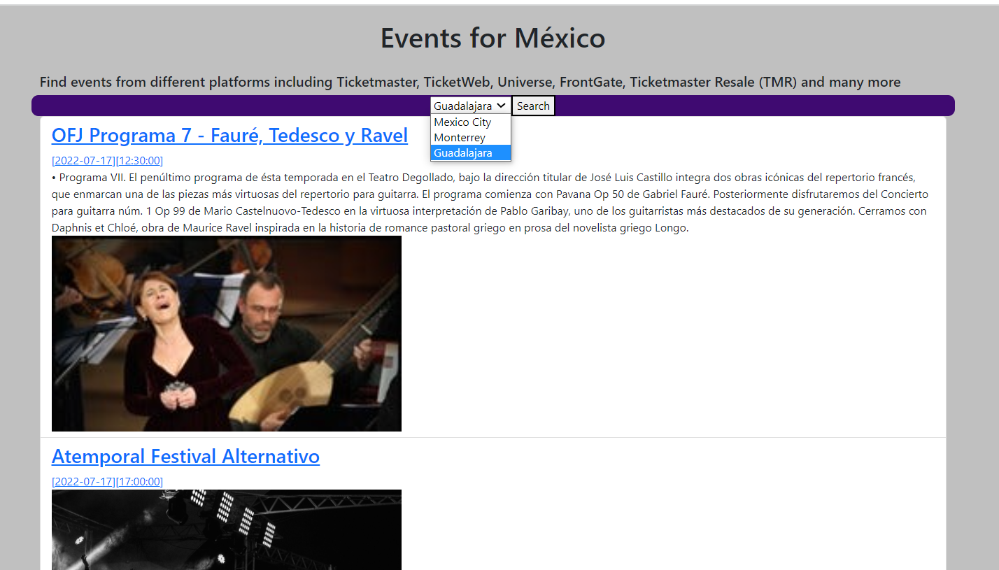

<div align="center" id="top"> 
  

  &#xa0;

  <!-- <a href="https://w15f_ticketmaster_events.netlify.app">Demo</a> -->
</div>

<h1 align="center">TicketMaster_events</h1>

<p align="center">
  

  

  

  

  <!--  -->

  <!--  -->

  <!--  -->
</p>

Status

<h4 align="center"> 
	🚧  TicketMaster_events 🚀 Under construction...  🚧
</h4> 

<hr>

<p align="center">
  <a href="#dart-about">About</a> &#xa0; | &#xa0; 
  <a href="#sparkles-features">Features</a> &#xa0; | &#xa0;
  <a href="#rocket-technologies">Technologies</a> &#xa0; | &#xa0;
  <a href="#white_check_mark-requirements">Requirements</a> &#xa0; | &#xa0;
  <a href="#checkered_flag-starting">Starting</a> &#xa0; | &#xa0;
  <a href="#memo-license">License</a> &#xa0; | &#xa0;
  <a href="https://github.com/gibranalcazar" target="_blank">Author</a>
</p>

<br>

## :dart: About ##

This is an API to search for events in the markets of Ticketmaster in México, which are México City, Guadalajara and Monterrey

## :sparkles: Features ##

:heavy_check_mark: Select the city;\
:heavy_check_mark: You can see events, dates and pictures;\
:heavy_check_mark: There is pagination applied;

## :rocket: Technologies ##

The following tools were used in this project:


- [Node.js](https://nodejs.org/en/)
- [React](https://pt-br.reactjs.org/)
- [JavaScript]
- [HTML]
- [CSS]

## :white_check_mark: Requirements ##

Before starting :checkered_flag:, you need to have [Git](https://git-scm.com) and [Node](https://nodejs.org/en/) installed.

## :checkered_flag: Starting ##

```bash
# Clone this project
$ git clone https://github.com/gibranalcazar/API-Ticketmaster

# Access
$ cd API-Ticketmaster

# Install Http-server if you don´t have it already
$ npm install --global http-server

# Run the project
$ http-server -c-1

# Normally the server will initialize in the <http://localhost:8080>
```

## :memo: License ##

This project is under license from MIT. For more details, see the [LICENSE](LICENSE.md) file.


Made with :heart: by <a href="https://github.com/gibranalcazar" target="_blank">Gibrán Alcázar</a>

&#xa0;

<a href="#top">Back to top</a>
